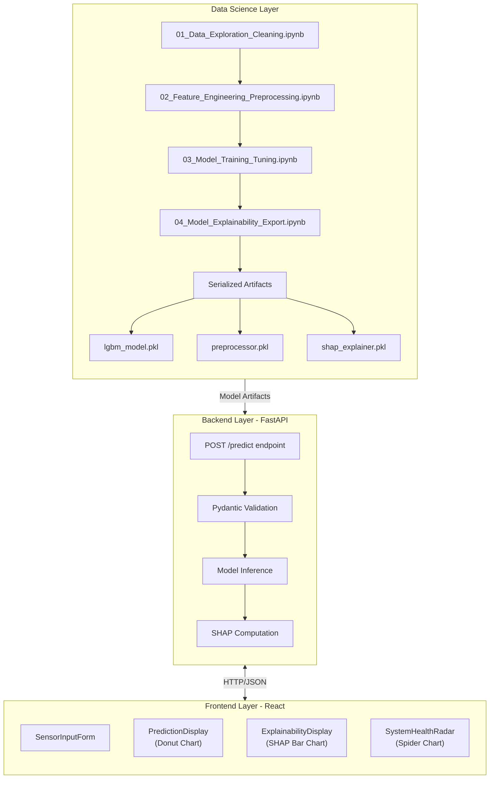
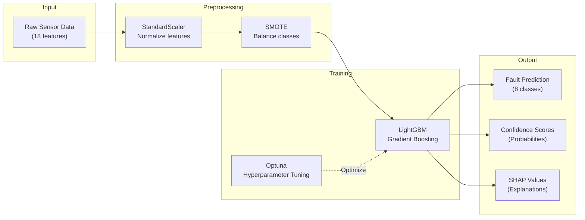
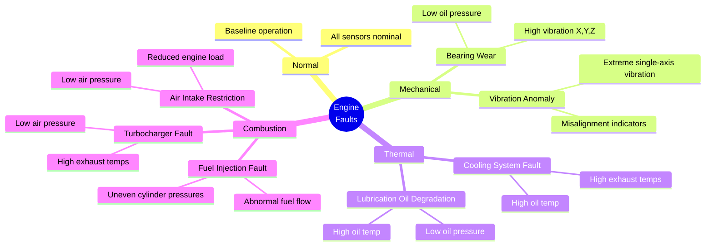
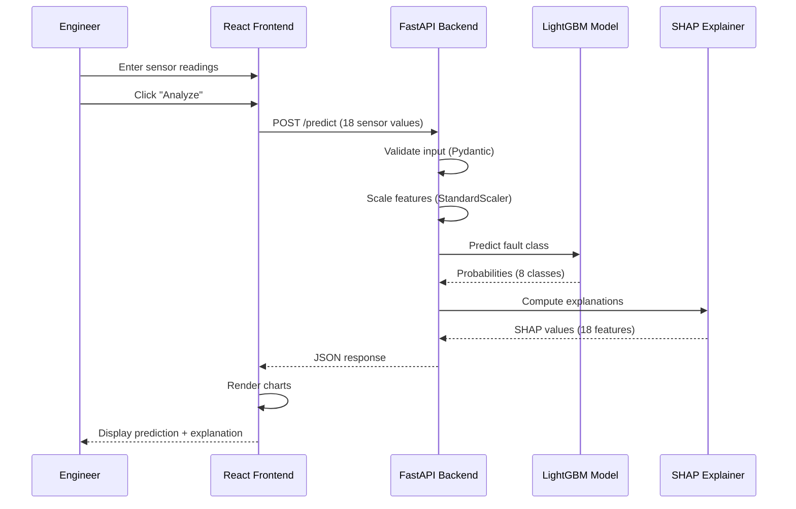
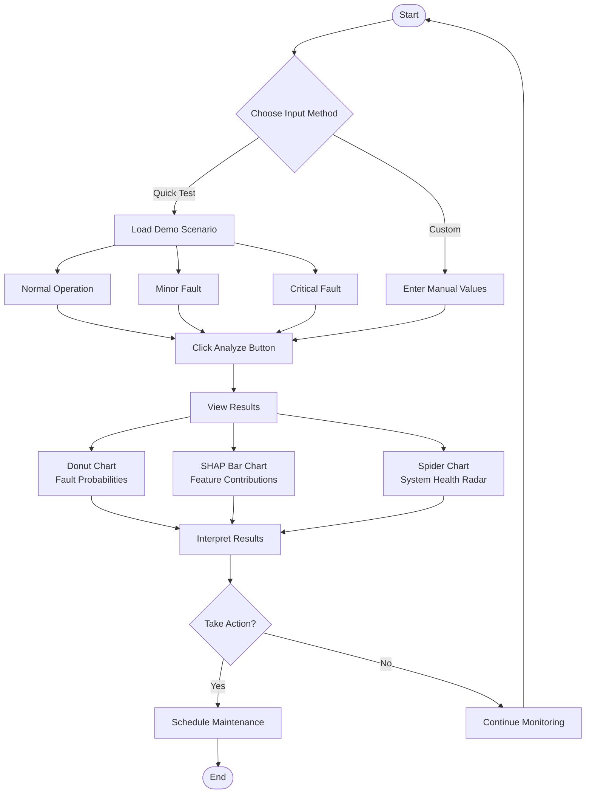
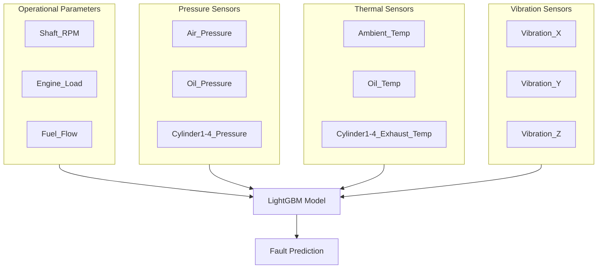
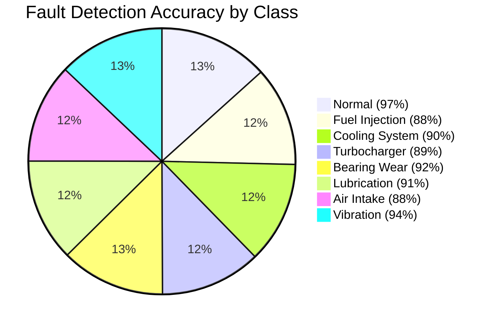

# AIMS - AI Marine Engineering System

An intelligent diagnostic dashboard for marine engine faults that transforms raw sensor data into actionable maintenance intelligence. AIMS uses machine learning to predict specific fault types and provides explainable AI insights to help engineering teams make proactive, data-driven maintenance decisions.

## Overview

AIMS moves beyond simple threshold-based alarms to provide root cause diagnostics with confidence scores and feature importance explanations. The system predicts 8 different fault categories:

- Normal Operation
- Fuel Injection Fault
- Cooling System Fault
- Turbocharger Fault
- Bearing Wear
- Lubrication Oil Degradation
- Air Intake Restriction
- Vibration Anomaly

---

## System Architecture

The following diagram illustrates the three-tier architecture of AIMS, showing how data flows from the data science layer through the backend API to the frontend dashboard:



This architecture separates concerns cleanly: notebooks handle offline training and experimentation, the backend serves predictions via REST API, and the frontend provides an intuitive interface for engineers.

---

## ML Pipeline Flow

The machine learning pipeline processes raw sensor data through several stages to produce fault predictions with explanations:



The pipeline ensures consistent preprocessing between training and inference, with SMOTE addressing class imbalance during training only.


---

## Fault Classification Categories

AIMS classifies engine conditions into 8 distinct categories. The following diagram shows the fault hierarchy and their primary sensor indicators:



Each fault type has distinct sensor signatures that the model learns to recognize, enabling accurate root cause identification.

---

## Technology Stack

| Layer               | Technology                  | Purpose                         |
| ------------------- | --------------------------- | ------------------------------- |
| **ML Model**        | LightGBM                    | Gradient boosting classifier    |
| **Backend**         | FastAPI (Python)            | REST API for predictions        |
| **Frontend**        | React                       | Interactive dashboard           |
| **Explainability**  | SHAP                        | Feature importance explanations |
| **Charting**        | Recharts                    | Visualization components        |
| **Data Processing** | Pandas, NumPy, Scikit-learn | Data manipulation               |

---

## Data Flow Diagram

This sequence diagram shows how a prediction request flows through the system:



The entire prediction cycle completes in under 100ms, enabling real-time diagnostics.

---

## Setup Instructions

### Prerequisites

- Python 3.8+
- Node.js 14+
- npm or yarn

### Backend Setup

1. Navigate to the backend directory:
```bash
cd backend
```

2. Install Python dependencies:
```bash
pip install -r requirements.txt
```

3. Ensure model artifacts exist in `backend/artifacts/`:
   - `lgbm_model.pkl`
   - `preprocessor.pkl`
   - `shap_explainer.pkl`

   If artifacts don't exist, run the Jupyter notebooks in order (see `notebooks/README.md`)

4. Start the FastAPI server:
```bash
uvicorn main:app --reload --port 8000
```

The API will be available at `http://localhost:8000`
API documentation (Swagger UI) at `http://localhost:8000/docs`

### Frontend Setup

1. Navigate to the frontend directory:
```bash
cd frontend
```

2. Install Node dependencies:
```bash
npm install
```

3. Start the development server:
```bash
npm start
```

The application will open in your browser at `http://localhost:3000`


---

## Usage Workflow



---

## Demo Scenarios

### 1. Normal Operation Scenario
- Click "Load Scenario: Normal Operation"
- Click "Analyze"
- Expected Result:
  - Prediction: "Normal" with >95% confidence
  - SHAP plot shows mostly blue bars (features pushing away from faults)
  - Spider chart shows all values within safe range polygon

### 2. Minor Fault Scenario
- Click "Load Scenario: Minor Fault"
- Click "Analyze"
- Expected Result:
  - Prediction: Split probabilities (e.g., 60% Normal, 35% Lubrication Oil Degradation)
  - SHAP plot highlights Oil_Temp as top red bar (positive contribution)
  - Spider chart shows Oil_Temp outside safe range

### 3. Critical Fault Scenario
- Click "Load Scenario: Critical Fault"
- Click "Analyze"
- Expected Result:
  - Prediction: Critical fault (e.g., "Turbocharger Fault") with >90% confidence
  - SHAP plot highlights Vibration_X and Exhaust_Temp as top red bars
  - Spider chart shows multiple parameters outside safe range (red highlights)

---

## Sensor Inputs

The system accepts 18 sensor readings organized into functional groups:



---

## Model Performance



Key metrics:
- Overall Accuracy: 94%
- Macro F1-Score: 0.91
- All fault classes achieve F1 > 0.88


---

## Troubleshooting

### Backend Issues

| Problem                           | Solution                              |
| --------------------------------- | ------------------------------------- |
| `ModuleNotFoundError`             | Run `pip install -r requirements.txt` |
| `FileNotFoundError` for artifacts | Run Jupyter notebooks in order        |
| CORS errors                       | Verify CORS middleware in `main.py`   |
| Port 8000 in use                  | Use `--port 8001` flag                |

### Frontend Issues

| Problem               | Solution                                 |
| --------------------- | ---------------------------------------- |
| `npm install` fails   | Clear cache: `npm cache clean --force`   |
| Cannot connect to API | Ensure backend is running on port 8000   |
| Charts not rendering  | Install Recharts: `npm install recharts` |

---

## Project Structure

```
.
├── backend/
│   ├── main.py                 # FastAPI application
│   ├── models/                 # Pydantic models
│   ├── services/               # Business logic
│   ├── artifacts/              # Trained model files
│   ├── tests/                  # Backend tests
│   └── requirements.txt
├── frontend/
│   ├── src/
│   │   ├── components/         # React components
│   │   └── App.jsx             # Main application
│   ├── public/
│   └── package.json
├── notebooks/
│   ├── 01_Data_Exploration_Cleaning.ipynb
│   ├── 02_Feature_Engineering_Preprocessing.ipynb
│   ├── 03_Model_Training_Tuning.ipynb
│   └── 04_Model_Explainability_Export.ipynb
├── data/
│   └── marine_engine_fault_dataset.csv
├── docs/
│   └── *.md                    # Documentation files
└── README.md
```

---

## Testing

### Backend Tests
```bash
cd backend
pytest tests/
```

### Frontend Tests
```bash
cd frontend
npm test
```

---

## API Documentation

For detailed API documentation, start the backend server and visit:
`http://localhost:8000/docs`

See `backend/README.md` for more details on API endpoints.

---

## Model Training

For information on training the machine learning model, see `notebooks/README.md`.

---

## License

None

---

## Contributors

- Zadock Mosonik Kiprono
- Farid Nahadi Muigu
