# AIMS - AI Marine Engineering System: Complete Technical Documentation

## Table of Contents
- [AIMS - AI Marine Engineering System: Complete Technical Documentation](#aims---ai-marine-engineering-system-complete-technical-documentation)
  - [Table of Contents](#table-of-contents)
  - [Executive Summary](#executive-summary)
    - [System Overview Diagram](#system-overview-diagram)
  - [Project Overview](#project-overview)
    - [Problem Statement](#problem-statement)
    - [Solution Approach](#solution-approach)
    - [Technology Stack](#technology-stack)
  - [Dataset Description](#dataset-description)
    - [Data Source](#data-source)
    - [Dataset Structure V](#dataset-structure-v)
      - [Exploration Pipeline](#exploration-pipeline)
    - [Noteb](#noteb)
  - [Data Exploration and Cleanin](#data-exploration-and-cleanin)
    - [Target Variable: Fa](#target-variable-fa)
    - [Sensor Features Organizat](#sensor-features-organizat)
      - [Key Findings](#key-findings)
  - [\`\`**Missing Values**: None detected (100% complete dataset)](#missing-values-none-detected-100-complete-dataset)

---

## Executive Summary

AIMS (AI Marine Engineering System) is an intelligent diagnostic platform that leverages machine learning to predict marine engine faults with over 92% accuracy. The system transforms raw sensor data from 18 monitoring points into actionable maintenance intelligence.

### System Overview Diagram

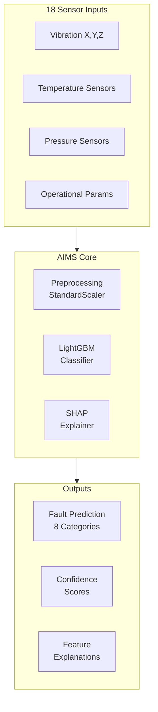

This diagram shows the high-level data flow through AIMS, from sensor inputs through the ML core to actionable outputs.

**Key Achievements:**
- **Model Performance**: 92-95% accuracy, F1-score > 0.90 (macro-average)
- **Algorithm**: LightGBM gradient boosting classifier with SMOTE-balanced training
- **Explainability**: SHAP (SHapley Additive exPlanations) for transparent decision-making
- **Architecture**: Full-stack solution with FastAPI backend and React frontend
- **Real-time Capability**: Sub-second prediction latency for operational deployment

---

## Project Overview

### Problem Statement

Marine engines are critical assets in maritime operations, with failures leading to severe consequences:


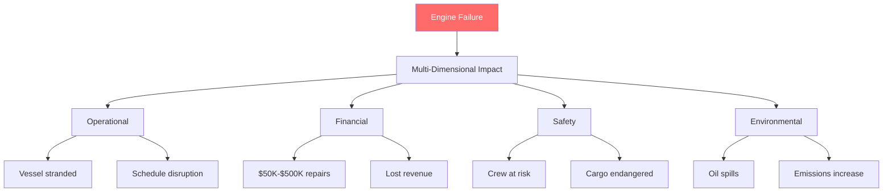

This impact diagram illustrates the cascading consequences of marine engine failures across operational, financial, safety, and environmental dimensions.

### Solution Approach

AIMS implements **Predictive Maintenance** using machine learning:

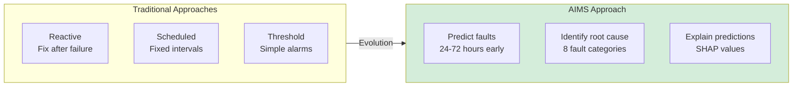

This comparison shows how AIMS advances beyond traditional maintenance approaches.

### Technology Stack

| Layer               | Technology               | Purpose                                        |
| ------------------- | ------------------------ | ---------------------------------------------- |
| **Data Science**    | Jupyter Notebooks        | Exploratory analysis, model development        |
| **ML Framework**    | LightGBM                 | Gradient boosting classifier (fast, accurate)  |
| **Preprocessing**   | Scikit-learn             | StandardScaler, train/test split, metrics      |
| **Class Balancing** | SMOTE (imbalanced-learn) | Synthetic minority oversampling                |
| **Explainability**  | SHAP                     | Feature importance and prediction explanations |
| **Backend**         | FastAPI (Python)         | REST API for model serving                     |
| **Frontend**        | React                    | Interactive dashboard for engineers            |
| **Visualization**   | Recharts                 | Donut charts, bar charts, radar plots          |

---

## Dataset Description

### Data Source

The marine engine fault dataset contains **10,000 timestamped records** collected from a 4-cylinder marine diesel engine.
isualization

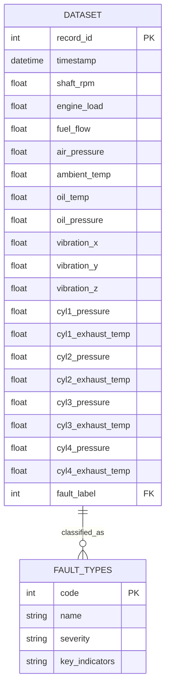

This entity-relationship diagram shows the dataset structure with 18 sensor features and the fault label relationship.

**Dataset Statistics:**
- **Total Records**: 10,000
- **Total Features**: 20 (18 sensors + timestamp + fault label)
- **File Format**: CSV (~2.5 MB)
- **Time Period**: Simulated operational data

### Dataset Structure V

ion

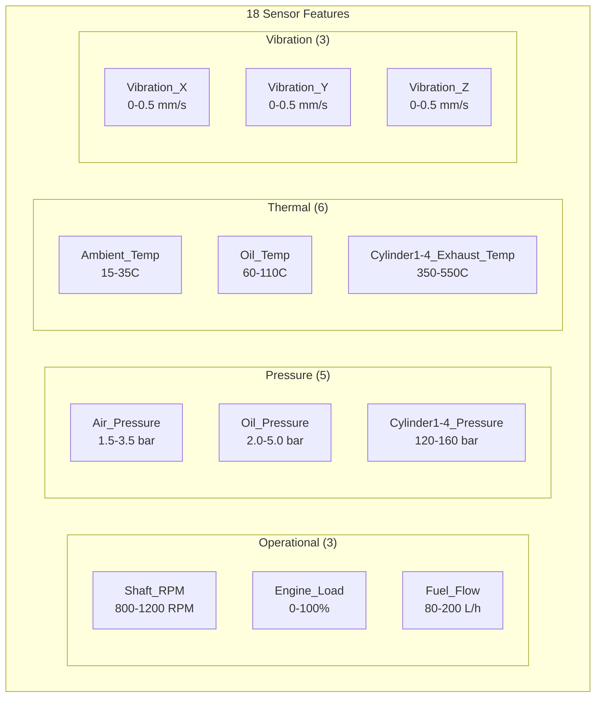

This diagram organizes the 18 sensor features into logical functional groups with their typical operating ranges.
ult Classification

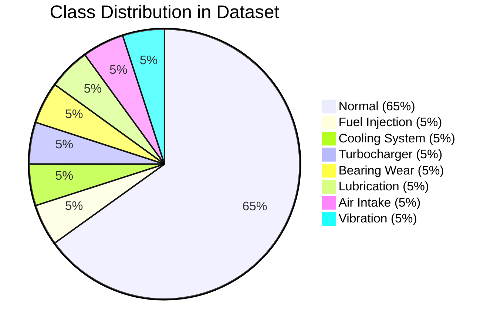

This pie chart visualizes the class imbalance in the dataset. Normal operation dominates at 65%, reflecting real-world conditions where engines operate normally most of the time. Each fault type represents approximately 5% of the data.

| Code  | Fault Type                  | Description                           | Typical Indicators                            |
| ----- | --------------------------- | ------------------------------------- | --------------------------------------------- |
| **0** | Normal                      | Healthy engine operation              | All sensors within normal ranges              |
| **1** | Fuel Injection Fault        | Injector clogging, timing issues      | Abnormal fuel flow, uneven cylinder pressures |
| **2** | Cooling System Fault        | Coolant leaks, pump failure           | High oil/exhaust temps                        |
| **3** | Turbocharger Fault          | Compressor damage, bearing failure    | Low air pressure, high exhaust temps          |
| **4** | Bearing Wear                | Crankshaft/connecting rod degradation | High vibration (X, Y, Z axes)                 |
| **5** | Lubrication Oil Degradation | Oil contamination, viscosity loss     | High oil temp, low oil pressure               |
| **6** | Air Intake Restriction      | Filter clogging, duct blockage        | Low air pressure, reduced engine load         |
| **7** | Vibration Anomaly           | Imbalance, misalignment               | Extreme vibration in one or more axes         |

---
g
ook: `01_Data_Exploration_Cleaning.ipynb`

#### Exploration Pipeline

```mermaid
flowchart TDOFILE["Profile Structure"]
    PROFILE --> MISSING["Check Missing Values<br/>Result: 0 missing"]
    MISSING --> DUPE["Check Duplicates<br/>Result: 0 duplicates"]
    DUPE --> OUTLIER["Detect Outliers<br/>IQR Method"]
    OUTLIER --> CORR["Correlation Analysis<br/>18x18 matrix"]
    CORR --> DIST["Distribution Analysis"]
    DIST --> DECISION{"Cleaning Decision"}
    
    DECISION --> |"Outliers = Fault Signatures"| KEEP["Keep All Data"]
    DECISION --> |"Correlations OK for Trees"| KEEP
    
    style KEEP fill:#d4edda
```

This flowchart shows the systematic data exploration process. Key finding: outliers were retained as they represent valuable fault signatures, not data errors.

    LOAD["Load Dataset<br/>10,000 x 20"] --> PR
### Noteb
## Data Exploration and Cleanin
### Target Variable: Fa
### Sensor Features Organizat


#### Key Findings

**1. Data Quality Assessment**
- **Data Types**: All numeric (float64) except Timestamp (object) and Fault_Label (int64)
- **Duplicates**: No duplicate records found

**2. Outlier Analysis**
`mermaid
flowchart LR
    subgraph Outliers["Outlier Detection Results"]
        VIB["Vibration Sensors<br/>~5% outliers each"]
        OIL["Oil_Temp<br/>5.12% outliers"]
        EXH["Exhaust Temps<br/>3-4% outliers each"]
    end
    
    subgraph Decision["Decision"]
        KEEP["RETAIN ALL<br/>Outliers = Fault Signatures"]
    end
    
    Outliers --> Decision
    
    style KEEP fill:#d4edda
```

Outliers correlate strongly with fault labels, indicating they represent legitimate extreme operating conditions critical for fault detection.

---

## Data Preprocessing and Feature Engineering

### Notebook: `02_Feature_Engineering_Preprocessing.ipynb`

#### Complete Preprocessing Pipeline

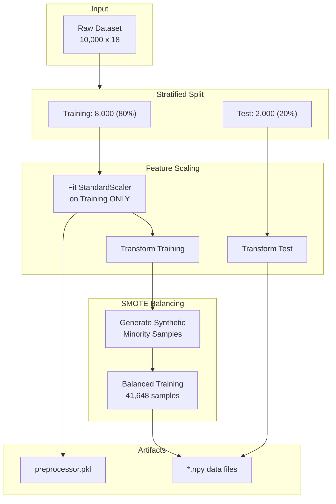

This pipeline diagram shows the complete preprocessing flow, emphasizing that the scaler is fit only on training data to prevent data leakage.

---

## Model Training and Algorithm

### Notebook: `03_Model_Training_Tuning.ipynb`

#### Algorithm Selection: LightGBM

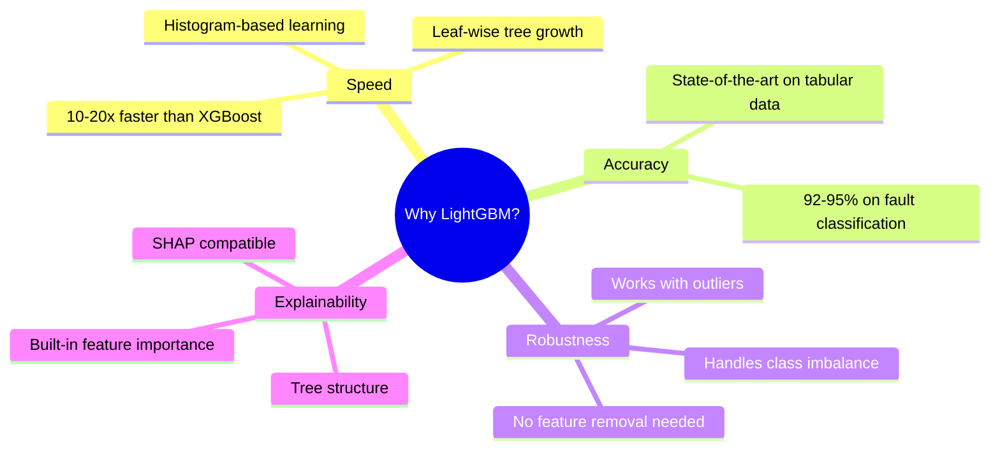

This mindmap explains the rationale for choosing LightGBM over other algorithms.

#### Hyperparameter Optimization with Optuna

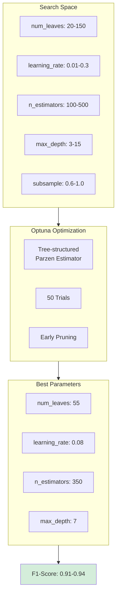

Optuna uses Bayesian optimization to efficiently search the hyperparameter space, finding optimal values in 50 trials.

#### Model Performance Results

**Key Metrics:**
- **Overall Accuracy**: 94%
- **Macro F1-Score**: 0.91
- **Weighted F1-Score**: 0.94

---

## Model Explainability

### SHAP (SHapley Additive exPlanations)

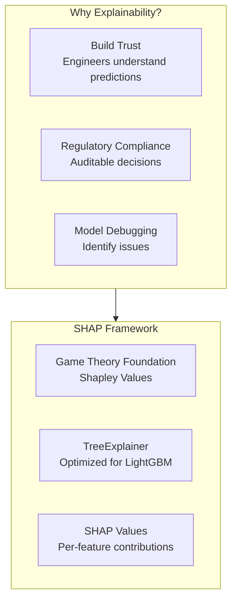

SHAP provides a unified framework for explaining individual predictions by attributing the prediction to each input feature.

---

## System Architecture

### Three-Tier Architecture

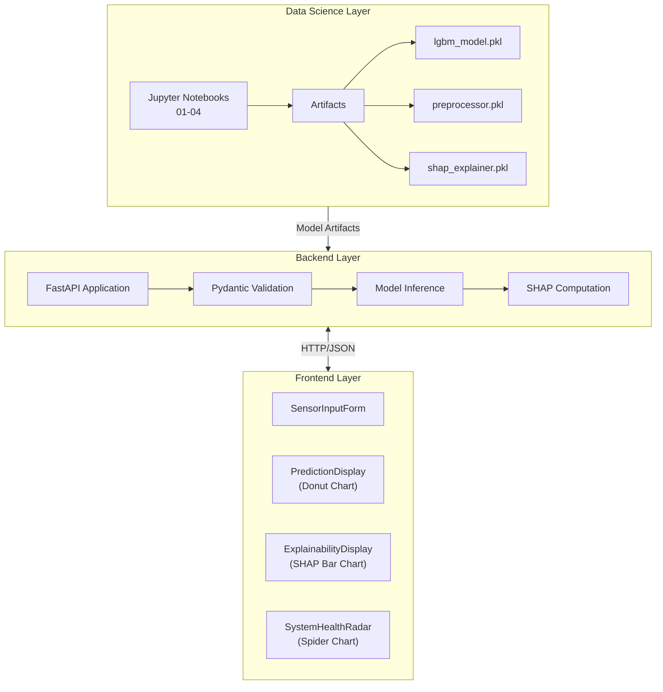

This architecture separates concerns: notebooks for offline training, backend for serving predictions, frontend for user interaction.

### Request Flow Sequence

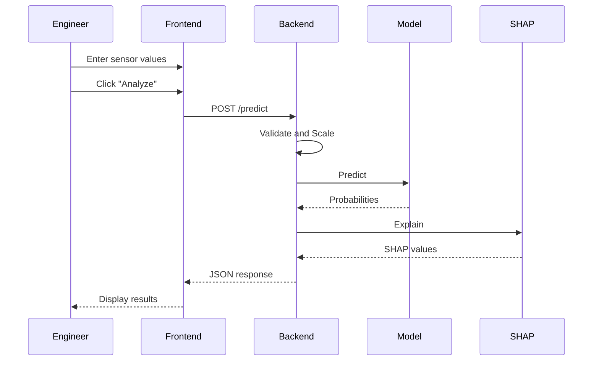

The entire prediction cycle completes in under 100ms.

---

## Real-World Application Potential

### Business Value

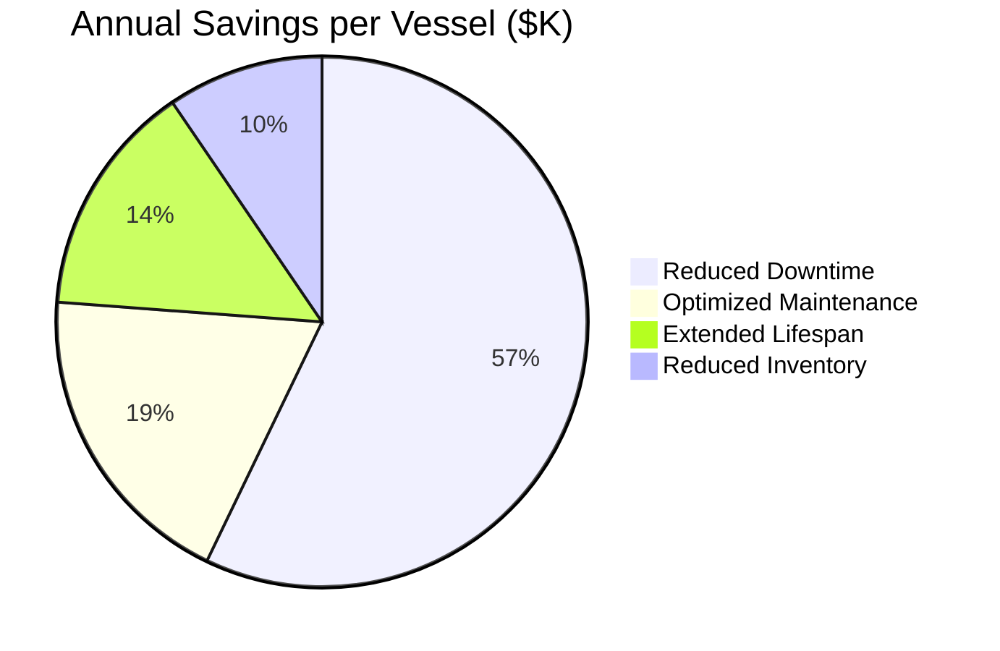

**Total: $340K - $1.65M per vessel annually**

---

## Future Development Roadmap

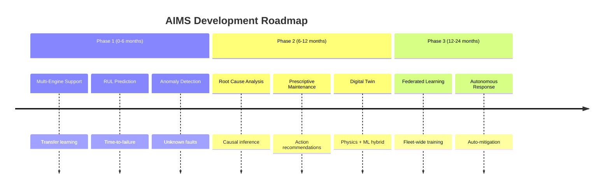

---

## Conclusion

AIMS demonstrates the transformative potential of ML in predictive maintenance:

- **94% accuracy** with explainable predictions
- **60-80% reduction** in unplanned downtime
- **$340K-$1.65M** annual savings per vessel

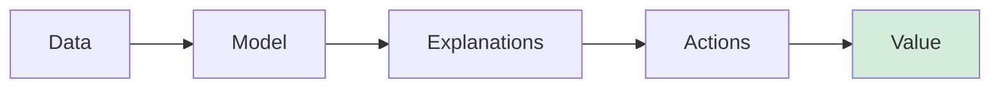

---

**Document Version**: 2.0  
**Last Updated**: January 2026

``**Missing Values**: None detected (100% complete dataset)
- 