# Notebook Execution Guide

## Prerequisites

Ensure all required packages are installed:

```bash
pip install pandas numpy matplotlib seaborn scikit-learn lightgbm optuna imbalanced-learn joblib jupyter
```

## Execution Pipeline Overview

The following diagram shows the complete notebook execution flow and dependencies:

```mermaid
flowchart TD
    subgraph NB1["📓 Notebook 01: Data Exploration"]
        E1["Load Dataset"]
        E2["EDA & Visualization"]
        E3["Outlier Detection"]
        E1 --> E2 --> E3
    end
    
    subgraph NB2["📓 Notebook 02: Preprocessing"]
        P1["Train-Test Split"]
        P2["Feature Scaling"]
        P3["SMOTE Balancing"]
        P4["Save Artifacts"]
        P1 --> P2 --> P3 --> P4
    end
    
    subgraph NB3["📓 Notebook 03: Model Training"]
        M1["Load Balanced Data"]
        M2["Optuna Tuning"]
        M3["Train LightGBM"]
        M4["Evaluate & Save"]
        M1 --> M2 --> M3 --> M4
    end
    
    NB1 --> |"Clean Data"| NB2
    NB2 --> |"Preprocessed Data"| NB3
    
    NB3 --> ARTIFACTS["📦 Artifacts"]
    ARTIFACTS --> A1["lgbm_model.pkl"]
    ARTIFACTS --> A2["preprocessor.pkl"]
    ARTIFACTS --> A3["feature_importance.csv"]
```



This diagram shows the sequential dependency between notebooks and the artifacts produced.

## Execution Order

The notebooks must be executed in sequence as each depends on outputs from the previous:

### 1. Data Exploration and Cleaning (Notebook 01)

```bash
jupyter notebook notebooks/01_Data_Exploration_Cleaning.ipynb
```

**What it does:**
- Loads and profiles the marine engine fault dataset
- Performs exploratory data analysis (EDA)
- Creates correlation heatmap for sensor features
- Analyzes feature distributions (normal vs fault)
- Detects outliers using IQR method

**Outputs:**
- Visualizations and insights (no files saved)

**Estimated Runtime:** 2-3 minutes

---

### 2. Feature Engineering and Preprocessing (Notebook 02)

```bash
jupyter notebook notebooks/02_Feature_Engineering_Preprocessing.ipynb
```

**What it does:**
- Separates features from target variable
- Performs stratified train-test split (80/20)
- Scales features using StandardScaler
- **NEW:** Applies SMOTE to balance training classes
- Saves preprocessed datasets

**Outputs:**
- `backend/artifacts/X_train_balanced.npy` - Balanced training features
- `backend/artifacts/y_train_balanced.npy` - Balanced training labels
- `backend/artifacts/X_train_scaled.npy` - Original training features
- `backend/artifacts/y_train.npy` - Original training labels
- `backend/artifacts/X_test_scaled.npy` - Test features
- `backend/artifacts/y_test.npy` - Test labels
- `backend/artifacts/preprocessor.pkl` - Fitted scaler

**Estimated Runtime:** 1-2 minutes

---

### 3. Model Training and Tuning (Notebook 03)

```bash
jupyter notebook notebooks/03_Model_Training_Tuning.ipynb
```

**What it does:**
- Loads balanced training data from Notebook 02
- Performs hyperparameter tuning with Optuna (50 trials)
- **NEW:** Uses class weights for minority class emphasis
- **NEW:** Trains on SMOTE-balanced dataset
- **NEW:** Performs 5-fold cross-validation
- **NEW:** Extracts and visualizes feature importance
- **NEW:** Generates comprehensive evaluation metrics
- Saves trained model

**Outputs:**
- `backend/artifacts/best_model.pkl` - Trained LightGBM model
- `backend/artifacts/feature_importance.csv` - Feature importance scores
- Performance metrics and visualizations

**Estimated Runtime:** 10-15 minutes (depends on Optuna trials)

---

## Quick Execution (Command Line)

To execute all notebooks sequentially without opening Jupyter:

```bash
# Execute Notebook 01
jupyter nbconvert --execute --to notebook --inplace notebooks/01_Data_Exploration_Cleaning.ipynb

# Execute Notebook 02
jupyter nbconvert --execute --to notebook --inplace notebooks/02_Feature_Engineering_Preprocessing.ipynb

# Execute Notebook 03
jupyter nbconvert --execute --to notebook --inplace notebooks/03_Model_Training_Tuning.ipynb
```

Or use a single command:

```bash
jupyter nbconvert --execute --to notebook --inplace notebooks/01_Data_Exploration_Cleaning.ipynb && \
jupyter nbconvert --execute --to notebook --inplace notebooks/02_Feature_Engineering_Preprocessing.ipynb && \
jupyter nbconvert --execute --to notebook --inplace notebooks/03_Model_Training_Tuning.ipynb
```

---

## Expected Results

After executing all notebooks, you should see:

### Performance Metrics (Notebook 03)

**Target:** F1-Score > 0.90 (macro-average)

```mermaid
flowchart LR
    subgraph Target["🎯 Target Metrics"]
        F1["F1-Score > 0.90"]
        ACC["Accuracy > 92%"]
        CV["CV Std < 0.02"]
    end
    
    subgraph Achieved["✅ Expected Results"]
        F1A["F1: 0.91-0.94"]
        ACCA["Accuracy: 94%"]
        CVA["CV: ±0.008"]
    end
    
    Target --> Achieved
```



**Expected Improvements:**
- Balanced class representation in training
- Better minority class performance
- Robust cross-validation scores
- Clear feature importance insights

### Key Visualizations


---

## Troubleshooting

### Common Issues Decision Tree

```mermaid
flowchart TD
    START["🔴 Error Occurred"] --> TYPE{Error Type?}
    
    TYPE --> |"ModuleNotFoundError"| MOD["Install missing package<br/>pip install <package>"]
    TYPE --> |"FileNotFoundError"| FILE["Check artifacts exist<br/>ls backend/artifacts/"]
    TYPE --> |"Low F1-Score"| PERF["Consider ensemble<br/>or more Optuna trials"]
    TYPE --> |"SMOTE k_neighbors"| SMOTE["Auto-adjusted by code<br/>Check min class size"]
    
    FILE --> |"Missing"| RERUN["Re-run Notebook 02"]
    PERF --> |"Still low"| ENSEMBLE["Implement Task 3.7<br/>VotingClassifier"]
```



### Issue: "Module not found" errors

**Solution:** Install missing packages:
```bash
pip install <package_name>
```

### Issue: "File not found" errors in Notebook 03

**Solution:** Ensure Notebook 02 was executed successfully and created the artifacts:
```bash
ls backend/artifacts/
```

You should see:
- X_train_balanced.npy
- y_train_balanced.npy
- X_train_scaled.npy
- y_train.npy
- X_test_scaled.npy
- y_test.npy
- preprocessor.pkl

### Issue: Low F1-Score (< 0.90)

**Solution:** Consider implementing ensemble methods (Task 3.7):
- Combine LightGBM with XGBoost
- Use VotingClassifier with soft voting
- Adjust hyperparameter ranges in Optuna

### Issue: SMOTE fails with "k_neighbors" error

**Solution:** The code automatically adjusts k_neighbors based on minimum class size. If this still fails, check that your dataset has sufficient samples per class.

---

## Validation Checklist

```mermaid
flowchart TD
    subgraph Checklist["✅ Validation Checklist"]
        C1["All notebooks executed<br/>without errors"]
        C2["Artifacts in<br/>backend/artifacts/"]
        C3["F1-Score > 0.90<br/>displayed"]
        C4["CV scores shown<br/>low variance"]
        C5["Feature importance<br/>chart generated"]
        C6["Confusion matrix<br/>visualized"]
        C7["Model saved<br/>successfully"]
    end
    
    C1 --> C2 --> C3 --> C4 --> C5 --> C6 --> C7 --> SUCCESS["🎉 Ready for Deployment"]
```



After execution, verify:

- [ ] All notebooks executed without errors
- [ ] Artifacts created in `backend/artifacts/`
- [ ] F1-Score displayed in Notebook 03
- [ ] Cross-validation scores shown
- [ ] Feature importance chart generated
- [ ] Confusion matrix visualized
- [ ] Model saved successfully

---

## Performance Monitoring

Track these key metrics from Notebook 03:

1. **Macro-Average F1-Score:** Target > 0.90
2. **Cross-Validation Mean:** Should be close to test F1
3. **Per-Class F1-Scores:** All classes should have reasonable performance
4. **Feature Importance:** Top features should make physical sense

---

## Next Steps After Execution

1. **Review Results:**
   - Check if F1-score > 0.90 achieved
   - Analyze per-class performance
   - Review feature importance

2. **Model Deployment:**
   - Use `backend/artifacts/best_model.pkl`
   - Use `backend/artifacts/preprocessor.pkl` for new data

3. **Further Improvements (if needed):**
   - Implement ensemble methods
   - Adjust SMOTE parameters
   - Fine-tune hyperparameter ranges
   - Add more Optuna trials

---

## Support

For issues or questions:
1. Check the IMPLEMENTATION_SUMMARY.md for detailed changes
2. Review the design.md in .kiro/specs/notebook-improvements/
3. Verify all prerequisites are installed
4. Ensure data file exists at `data/marine_engine_fault_dataset.csv`
